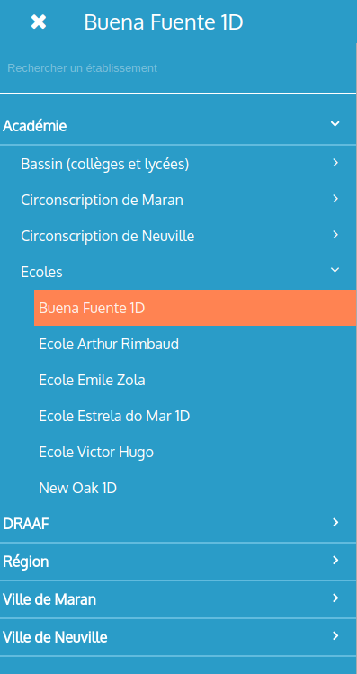
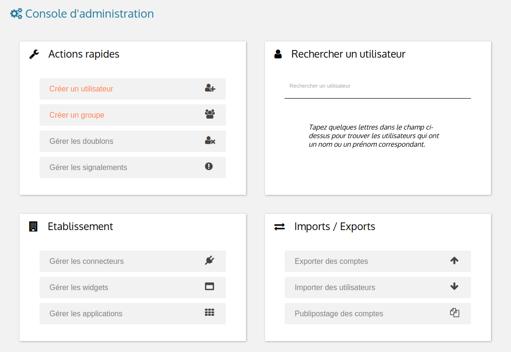
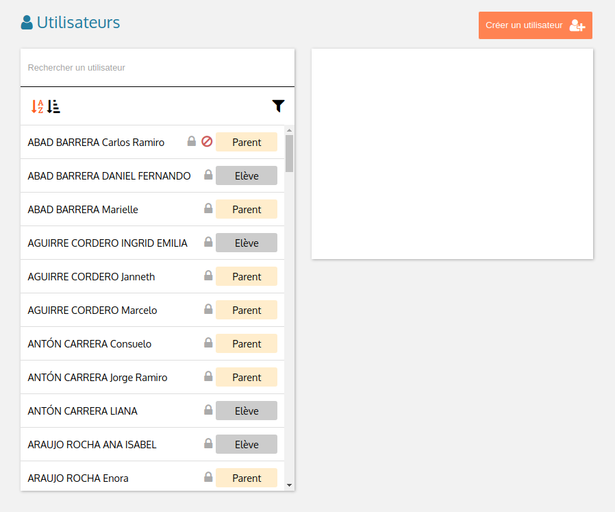
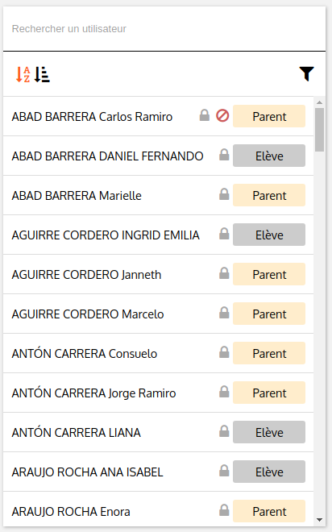
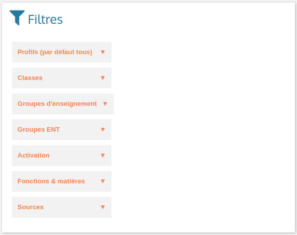

This document presents the Admin v2 project architecture. Document objective is to help developers understand the Admin v2 project files organization and source code architecture in order to get familiar with it and facilitate new admin v2 developer insertion.

# Project Repository

Admin v2 app is located in Entcore github repository:

URL  
    https://github.com/entcore/entcore

# Files Structure

## Root Folder

Admin v2 app resides inside **entcore** project, in **admin** folder:

    entcore/admin

## Dependencies

Needed dependencies for development and app execution (like Angular, TypeScript, Gulp, …​) are listed in:

    entcore/package.json

## Build Files

Admin v2 is bundled using **Webpack 2** and built through **Gulp** tasks.

> **Note**
>
> Build process is described here: <https://github.com/web-education/reference-manual/blob/master/dev/front/admin-v2/build-process>

### Entcore Build File

As part of Entcore project, Admin v2 can be built using Entcore build process, based on **Gulp**. The main **gulpfile** is located here:

    entcore/gulpfile.js

It contains the main **build** task, that builds all entcore front apps **including admin v2**.

### Admin V2 Build Files

Admin v2 can also be built **independently** from Entcore by using Admin v2 specific tasks. Admin v2 specific **gulpfile** is located here:

    entcore/admin/gulpfile.admin.js

It contains specific admin-v2 tasks:

clean  
clean generated files

build-dev  
build app, **dev** mode, see **webpack** configuration file *entcore/admin/webpack.config.dev.js*

build  
build app, **production** mode, see configuration file *entcore/admin/webpack.config.prod.js*

devserver  
build app and start a server supporting **hot reload**, configuration can be found in *entcore/admin/webpack.config.devserver.js*

watch  
copy resources files to springboard. Configure *springboardPath* variable in *entcore/admin/gulpfile.admin.js* to adjust your springboard path.

## Resources

Resources root folder:

    entcore/admin/src/main/resources

### Styles & Fonts

    resources/
        public/
            styles/
                admin.scss 
                flatpickr-confetti.css 
                generic-icons-1.0.0.woff 
                font-awesome-4.7.0/ 

-   Main SASS file: contains admin v2 styles. SASS file is compiled into CSS during build phase (see file: *entcore/admin/webpack.config.common.js* for more details)

-   Datepicker CSS file, this file is **generated during build phase** (see *copy-flatpickr-css* task in file *entcore/admin/gulpfile.admin.js*)

-   Generic icons lib, see: <https://github.com/entcore/generic-icons> for more details

-   Font Awesome icons

### I18n

    resources/
        i18n/
            en.json 
            fr.json 

-   Admin v2 is not yet translated in English

-   French file, contains all labels keys and values

## TypeScript

TypeScript files are located in:

    entcore/admin/src/main/ts

TypeScript files structure overview:

    ts/
        app/ 
        libs/ 
        main.aot.ts 
        main.ts 
        tsconfig.aot.json 
        tsconfig.json 

-   **app/**: app source code root, see [section\_title](#_app_architecture) for more details

-   **libs/**: contains vendors imports for webpack bundle

-   **main.aot.ts**: angular bootstrap for AOT mode (see: <https://angular.io/guide/aot-compiler> for more details on AOT compilation)

-   **main.ts**: angular bootstrap for dev mode

-   **tsconfig.aot.json**: typescript configuration for **production** mode → **AOT** compilation

-   **tsconfig.json**: typescript configuration for **dev** mode

# App Architecture

App source code structure:

    ts/
        app/
            core/ ................... core module (nav, resolvers, services, stores)
            groups/ ................. groups module (routing, resolvers, components)
            shared/ ................. shared module (UX components)
            structure/ .............. structure module (routing, resolvers, components)
            users/ .................. users module (routing, resolvers, components)
            app-home.component.ts ... app home component
            app-routing.module.ts ... app routing
            app.component.ts ........ app component (outlet for router)
            app.module.ts ........... app module

Admin v2 source code is splitted in Angular modules:

-   **app** module

-   **core** module

-   **groups** module

-   **shared** module

-   **structure** module

-   **users** module

-   …​ more modules to come :)

Each module contains its specifics **components**, **routing**, **resolvers**, and **stores**

The following section presents an overview of each module content:

## App Module

    app/app.module.ts

App module is the **main** module, **loaded by Angular bootstrap**.

App module contains all needed components and routing to display app home page.

App module lazy loads Structure module when a user clicks on a structure in structures tree.

### App Components

#### App

    app/app.component.ts

Bootstraped when module is loaded, it holds the **main router outlet**

#### AppHome

    app/app-home.component.ts

Loaded by the main route **/admin**, it displays app **home page message**:


> **Note**
>
> Navigation header is handled by Navigation Component from Core Module, see [Navigation Component](#NavigationComponent)

### App Routing

    app/app-routing.module.ts

Routing paths:

/admin  
Loads NavComponent (from Core module) and AppHomeComponent. Plus, fetches **User session information** and **Structures list** through **Resolvers** (*SessionResolve* and *StructuresResolve* from Core module).

/admin/:structureId  
Lazy load [section\_title](#_structure_module). More info about lazy loading here: <https://angular.io/guide/ngmodule#lazy-loading-modules-with-the-router>

### App Services

App module uses Services from Core Module, see [section\_title](#_core_services) section to learn more about it.

### App Stores

App module uses **Global Store** from Core Module, see [section\_title](#_global_store) section to learn more about it.

## Core Module

    app/core/core.module.ts

Imported by App module, Core module contains app core elements:

-   Navigation Component

-   Services

-   Resolvers

-   Stores

> **Important**
>
> Core module should only be imported by App module, to prevent side effects. A guard has been implemented to prevent this, see file: app/core/module-import-guard.ts

### Core Components

#### Nav

    app/core/nav/nav.component.ts

Loaded by the main route **/admin**, it displays **nav header**:


and **structures tree**:



### Core Services

#### Spinner

    app/core/services/spinner.service.ts

Displays spinner while performing asynchonous task:


Usage:

``` js
loadingService.perform('<spinner-placeholder>', <asynchronous-task>)
    .then()
    .catch()
```

Loading service is used in combination with a **spinner-cube** tag in a component:

``` html
<spinner-cube class="portal-spinner" waitingFor="portal-content"></spinner-cube>
```

where *waitingFor* attribute matches *&lt;spinner-placeholder&gt;*.

> **Tip**
>
> There is a spinner-cube tag in *app/core/nav/nav.component.ts*

#### Notify

    app/core/services/notify.service.ts

Displays Success/Error notification after user action:


Usage:

``` js
notifyService.success(
    {   key: '<content-i18n-key>',
        parameters: { user: this.user}
    }, '<title-i18n-key>')
)
```

will display a succesful notification pop-up for successful operation.

Notify service also provides an error function to display error pop-up for failed operation.

#### Plateforme-info

    app/core/services/plateforme-info.service.ts

Provides plateforme information, for example: is sms module enabled?

#### Profiles

    app/core/services/profiles.service.ts

Gets User profiles list.

#### Userlist Filters

    app/core/services/userlist.filters.service.ts

Services for User list filters, see <https://github.com/web-education/reference-manual/blob/dev-front-WIP2017/first-steps/admin-v2-howto-addUserFilter> to know how to add a new user filter.

#### Userlist

    app/core/services/userlist.service.ts

Provides utils functions for **sorting**, **filtering**, **paging** a user list.

### Core Resolvers

Resolvers are used by routing to fetch data needed by components before they are initialized. See <https://angular.io/api/router/Resolve> for more details about Angular Resolvers.

#### Session Resolver

    app/core/resolvers/session.resolve.ts

Gets user session information and stores it in Angular route data.

Usage:

Resolver is called by route /admin in app routing:

    path: 'admin', resolve: { session: SessionResolve }

where *session* is the storing Angular route data attribute.

Then Navigation component retrieves information using Angular route data:

    this.session = this.route.snapshot.data['session']

#### Structures Resolver

    app/core/resolvers/structures.resolve.ts

Syncs structures collection in Core [section\_title](#_global_store).

Usage:

Resolver is called by route /admin in app routing:

    path: 'admin', resolve: { StructuresResolve }

Resolver syncs structures collection in Core Global Store:

    globalStore.structures.sync()

Then Navigation component retrieves structures from Global Store as a structures tree:

    this.structures = globalStore.structures.asTree()

#### I18n Resolver

    app/core/resolvers/i18n.resolve.ts

Loads i18n files bundle: fr.json, en.json…​

Usage:

Resolver is called by route /admin in app routing:

    path: 'admin', resolve: { I18nResolve }

### Core Stores

#### Abstract Store

    app/core/store/abstract.store.ts

Abstract Store is the app Data Stores root class. It adds an observable to store attributes to trigger attribute changes → useful to detect when a store element has changed and do something accordingly

#### Global Store

    app/core/store/global.store.ts

Extends Abstract Store. It contains the Structures Collection. Global store is used to retrieve structures collection. Example:

``` js
import { globalStore } from 'path/to/store'

let structures = globalStore.structures.data
```

## Structure Module

Structure module root folder:

    app/structure

Structure module is defined in file:

    app/structure/structure.module.ts

Structure module is **lazy loaded** by App router for route **/admin/:structureId** (user picked a structure in the list).

Structure module contains all needed components, routing and resolvers for displaying structure information.

Structure module routing lazy loads [section\_title](#_users_module) and [section\_title](#_groups_module) when user clicks on User menu and Groups menu.

> **Tip**
>
> Structure module contains router outlet for displaying related users and groups.

### Structure Components

#### Structure

    app/structure/structure.component.ts

Loaded by route **/admin/:structureId**, Structure component hosts the router outlet for StructureHome component and related Users and Groups module.

#### StructureHome

    app/structure/structure-home.component.ts

Loaded by route **/admin/:structureId** (as child), StructureHome component displays **structure home page**:



Cards are handled by following components:

#### QuickActionsCard

    app/structure/cards/quick-actions-card.component.ts

Card **Quick actions** displays links to actions:

-   create user

-   create group

-   handle duplicate users

-   handle signals

#### UserSearchCard

    app/structure/cards/user-search-card.component.ts

Card **User search** displays a user search input.

#### ImportsExportsCard

    app/structure/cards/imports-exports-card.component.ts

Card **Import/Export** gives access to import export utilities.

#### StructureCard

    app/structure/cards/structure-card.component.ts

Card **Structure** gives access to manage connectors, widgets and applications.

### Structure Routing

    app/structure/structure-routing.module.ts

Routing paths:

/admin/:structureId  
Loads Structure and StructureHome components. Plus, fetches Structure information through **StructureResolver**:

-   Classes

-   Groups

-   User Profiles

-   Import Sources

-   AAF functions

/admin/:structureId/users  
Lazy loads [section\_title](#_users_module)

/admin/:structureId/groups  
Lazy loads [section\_title](#_groups_module)

### Structure Resolvers

    app/structure/structure.resolve.ts

Fetches structure information and stores it in Angular route data structure attribute.

Usage:

Resolver is called by route /admin/:structureId in structure routing:

    path: '', component: StructureComponent, resolve: { structure: StructureResolve }

where *session* is the storing Angular route data attribute.

Then StructureHome component retrieves information using an Observable on the route:

``` js
this.routeSubscriber = this.route.data.subscribe(data => {
    this.structure = data['structure']
    this.cdRef.markForCheck()
})
```

> **Important**
>
> Do not confuse with [section\_title](#_structures_resolver) which fetches structures collection.

### Structure Stores

No specific Store for Structure Module.

## Users Module

Users module root folder:

    app/users

Users module is defined in file:

    app/users/users.module.ts

Users module is **lazy loaded** by structure router for route **/admin/:structureId/users** (after user clicked in Users icon in nav header)

Users module contains all needed components, routing and resolvers for displaying users information.

Users module components are displayed in structure router-outlet defined in Structure Component (app/structure/structure.component.ts).

### Users Components

#### Users

    app/users/users.component.ts

Loaded by route **/admin/:structureId/users**, it is Users module **root component**.

It contains the **router outlet** for Users components.

It defines Users module page layout:

-   Users module header: title + create user button,

-   Users module body: [UserList component](#UserListComponent) on left side and [UserDetails](#UserDetailsComponent) or [UserCreate](#UserCreateComponent) or [UserFilters](#UserFiltersComponent) components on the right side:

    

> **Tip**
>
> Users component saves selected user in [section\_title](#_users_store) after user clicked on user in user list.

#### UserList

    app/users/list/user-list.component.ts

Loaded by [Users component](#UsersComponent), it displays current structure users list:



#### UserDetail

    app/users/details/user-details.component.ts

Loaded by route **/admin/:structureId/users/:userId**, it displays user details:


> **Note**
>
> Each section is a Component, defined in folder *app/users/details/sections*

#### UserFilters

    app/users/filters/user-filters.component.ts

Loaded by route **/admin/:structureId/users/filter**, it displays user filters:



#### UserCreate

    app/users/create/user-create.component.ts

Loaded by route **/admin/:structureId/users/create**, it displays user creation form:


### Users Routing

    app/users/users-routing.module.ts

Routing paths:

/admin/:structureId/users  
Loads [Users Component](#UsersComponent) and fetches current **structure users list** through [section\_title](#_users_resolver) and saves it in [section\_title](#_users_store).

/admin/:structureId/users/filter  
Loads [UserFilters Component](#UserFiltersComponent).

> **Tip**
>
> This is the route called after a user clicked on User module button in nav header.

/admin/:structureId/users/:userId  
Loads [UserDetails Component](#UserDetailsComponent) after user selected a user in users list and fetches current user details through [section\_title](#_user_resolver) and saves infomation in [section\_title](#_users_store).

/admin/:structureId/users/create  
Loads [UserCreate Component](#UserCreateComponent) after a user clicked on Create user button.

### Users Resolvers

#### Users Resolver

#### User Resolver

### Users Store

## Groups Module

### Groups Components

### Groups Routing

### Groups Stores

## UX Module

# Infra Components lib
